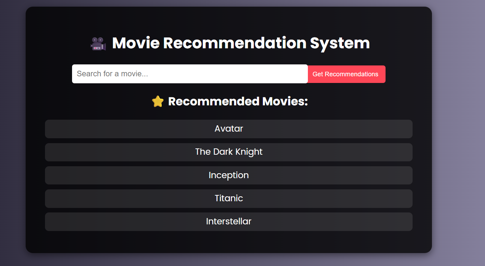
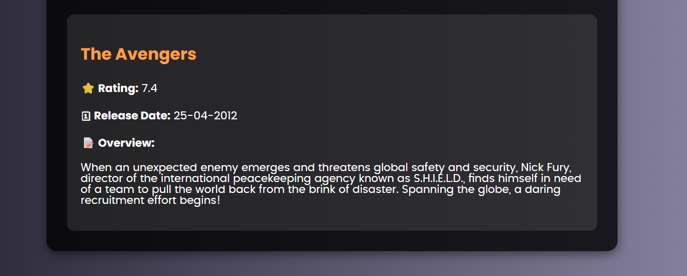

# 🎬 Movie Recommendation System

<p align="center">
  
  
  
  
  
</p>

> 🎥 A **full-stack Movie Recommendation System** built with Flask, Python, and Machine Learning.  
> Includes live movie search, fuzzy matching for typos, instant recommendations, and detailed movie reviews — all in one clean web app.

---

## ✨ Features

✅ **Content-Based Filtering** using TF-IDF + Cosine Similarity  
✅ **Live Search** – Movie titles appear as you type  
✅ **Fuzzy Matching** – Handles typos like `"Avatr"` → *Avatar*  
✅ **Instant Recommendations** – Top 5 similar movies instantly  
✅ **Movie Reviews** – Displays overview, rating, and release date  
✅ **Responsive Frontend** – HTML, CSS, and Vanilla JS  
✅ **Dynamic Flask API** – No page reloads, smooth interactivity  

---

## 🧠 Tech Stack

| Layer | Technology |
|-------|-------------|
| **Backend** | Flask (Python) |
| **Frontend** | HTML5, CSS3, JavaScript |
| **ML / Data Science** | scikit-learn, pandas, numpy |
| **Recommendation Model** | TF-IDF Vectorization + Cosine Similarity |
| **Fuzzy Search** | fuzzywuzzy |
| **Dataset** | [The Movies Dataset - Kaggle](https://www.kaggle.com/datasets/rounakbanik/the-movies-dataset) |

---

## 📁 Project Structure

```
MovieRecommendationSystem/
│
├── app.py                     # Flask backend
├── model/
│   ├── train_model.py         # ML model training script
│   ├── content_model.pkl      # Saved movie info (title + tags)
│   └── cosine_sim.pkl         # Saved similarity matrix
├── data/
│   ├── movies.csv             # Movie metadata
│   └── credits.csv            # Cast & crew data
├── static/
│   ├── style.css              # Frontend styles
│   └── script.js              # Frontend logic
├── templates/
│   └── index.html             # Webpage UI
└── README.md
```

---

## 🖼️ Example Screenshots

### 🏠 Home Page
<p align="center">
  
</p>

### 🎬 Movie Details + Recommendations
<p align="center">
  
</p>

---

## ⚙️ Installation & Setup

### 1️⃣ Clone the Repository
```bash
git clone https://github.com/yourusername/MovieRecommendationSystem.git
cd MovieRecommendationSystem
```

### 2️⃣ Create a Virtual Environment
```bash
python -m venv venv
```

### 3️⃣ Activate the Environment
**Windows:**
```bash
venv\Scripts\activate
```
**macOS/Linux:**
```bash
source venv/bin/activate
```

### 4️⃣ Install Dependencies
```bash
pip install -r requirements.txt
```

### 5️⃣ Train the Model (first time only)
```bash
cd model
python train_model.py
```

### 6️⃣ Run the App
```bash
python app.py
```

Then visit 👉 **http://127.0.0.1:5000**

---

## 💡 Future Improvements

- 🎞️ Add movie posters using **TMDB API**  
- 👤 Add login system + personalized watchlist  
- 💬 Include user reviews or ratings  
- 🌐 Deploy on **Render / Railway / Vercel**  

---

## 📜 License

This project is licensed under the [MIT License](LICENSE).

---

## 👨‍💻 Author

**Your Name**  
💼 [GitHub](https://github.com/yourusername)  
💌 [LinkedIn](https://linkedin.com/in/yourprofile)  
🌐 [Portfolio](https://yourportfolio.com)

---

⭐ **If you like this project, give it a star!** ⭐
>>>>>>> 8089598 (Initial commit - Movie Recommendation System project added)
